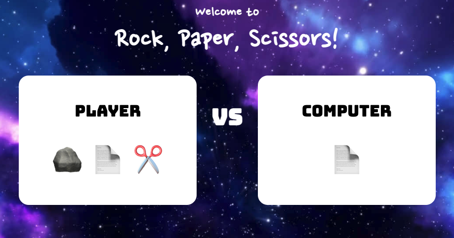

# Akmens, šķēres, papīrīts

## Uzstādīšana

1. Lejuplādējam spēles kodu [šeit](https://github.com/oganzins/rock-paper-scissors/archive/refs/heads/main.zip).
2. Atarhivējam sev vēlamajā vietā.
3. Atveram atarhivēto direktoriju **"rock-paper-scissors-main"**.
4. Atveram **index.html** interneta pārlūkā.
5. Pārliecināmies, ka ir redzams spēles logs.



## Uzdevums

Pašlaik, lai kāda būtu spēlētāja un datora izvēle, spēles rezultāts netiek attēlots. 
Ir nepieciešams implementēt spēles rezultāta paziņošanu atkarībā no spēlētāja un datora izvēles.
Izmantotā programmēšana valoda [JavaScript](https://en.wikipedia.org/wiki/JavaScript).


**Pa soļiem:**

1. Implementējamā funkcija **gameResultMessage(playerChoice, computerChoice)** atrodas failā **app.js**
2. Atveram failu **app.js** ar sev vēlamo teksta redaktoru.
3. Implementējam funkciju **gameResultMessage(playerChoice, computerChoice)**
4. Algoritms:
* Ja spēlētāja izvēle ir 🪨 un datora izvēle ir 🪨, tad rezultāts ir neizšķirts;
* Ja spēlētāja izvēle ir 🪨 un datora izvēle ir ✂️, tad uzvar spēlētājs;
* Ja spēlētāja izvēle ir 🪨 un datora izvēle ir 📄, tad uzvar dators;
* Ja spēlētāja izvēle ir ✂️ un datora izvēle ir 🪨, tad uzvar dators;
* Ja spēlētāja izvēle ir ✂️ un datora izvēle ir ✂️, tad rezultāts ir neizšķirts;
* Ja spēlētāja izvēle ir ✂️ un datora izvēle ir 📄, tad uzvar spēlētājs;
* Ja spēlētāja izvēle ir 📄 un datora izvēle ir 🪨, tad uzvar spēlētājs;
* Ja spēlētāja izvēle ir 📄 un datora izvēle ir ✂️, tad uzvar dators;
* Ja spēlētāja izvēle ir 📄 un datora izvēle ir 📄, tad rezultāts ir neizšķirts;

## Noderīgi uzdevuma izpildei

### Mainīga definēšana un vērtības piešķiršana JavaScript valodā

```javascript
let name = "Ieva"
let age = 25
let awesome = true
```

### If operators JavaScript valodā

```javascript
let country = prompt("What country are you from?")

if (country === "Latvia") {
    alert("You are cool")
}

if (country !== "Latvia") {
    alert("Too bad for you")
}
```

### If-Else operatori JavaScript valodā

```javascript
let age = prompt("How old are you?")

if (age < 18) {
    alert("You cannot apply")
} else {
    alert("You can apply")
}
```

### If-Else If operatori JavaScript valodā

```javascript
if (age < 18) {
    alert("you can't apply")
} else if (age > 120) {
    alert("you can't apply")
} else {
    alert("you can apply")
}
```

### Operators AND

```javascript
if (continent === "Europe" && language === "Latvian") {
  alert("You are from Latvia")
} else {
  alert("You are not from Latvia")
}
```

### Operators OR

```javascript
if (age < 18 || age > 120) {
    alert("you can't apply")
}
```
